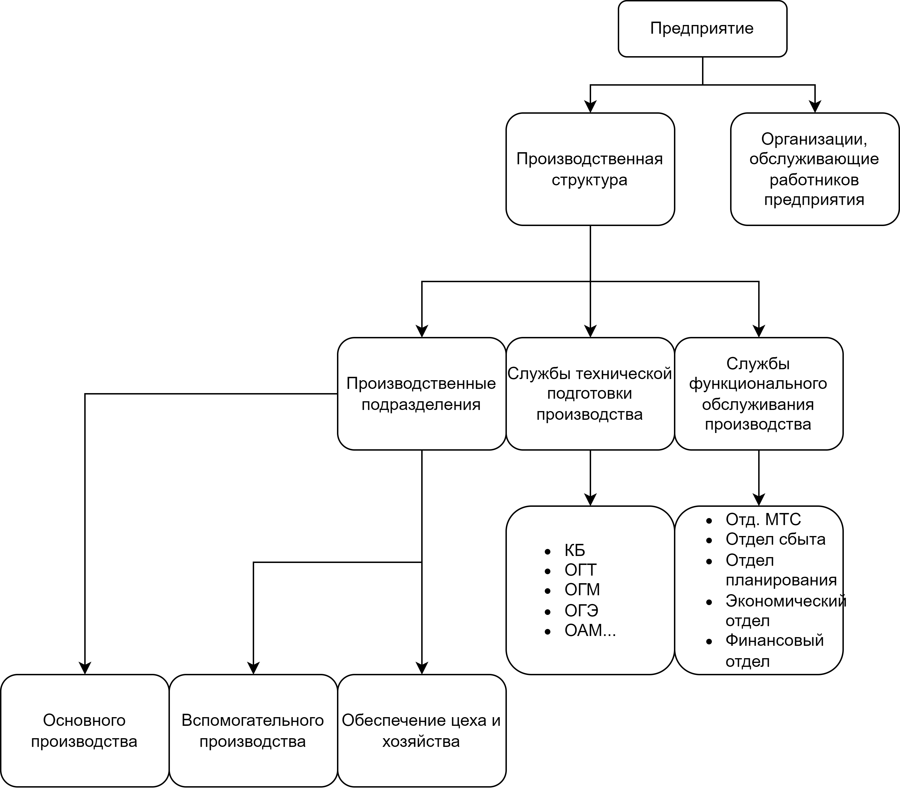
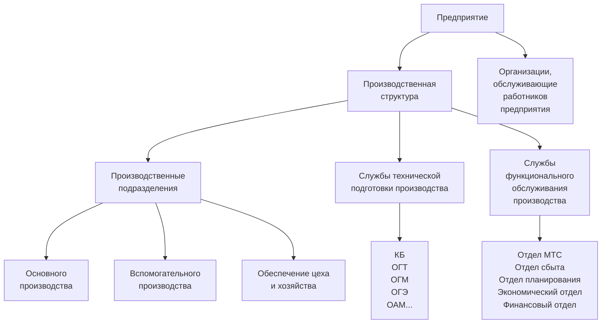

- [Лекция 1](#лекция-1)
  - [Историческая справка](#историческая-справка)
  - [Органиазция производственных процессов](#органиазция-производственных-процессов)
    - [Общая и производственная структура предприятия](#общая-и-производственная-структура-предприятия)
- [Лекция 2](#лекция-2)

Постникова Елена Сергеевна

ИБМ-2 к. 506

postnikova.el@bmstu.ru

postnikova.el@yandex.ru

8-916-733-16-46

# Лекция 1

## Историческая справка

Советов и Платонов разработали русскую школу обучения механическим мастерствам:

1. Токарные искусства по дереву
2. Столярные 
3. Кузнечные
4. Токарные по металлу
5. Слесарные
6. Модельные

В качестве пособий - модели реальных инструментов в увеличенном масштабе и коллекции измерительных инструментов с указанием областей и способов их применения. 

Заслуга Советова и Платонова заключается в том что они смогли выделить элементарные последовательности работ для каждого вида мастерства.

Не выделили технологическую операцию - не хватило одного шага для того чтобы стать первыми авторами организации производства.

Фредерик Тейлор:

1. Отделил подготовительные работы от выполнения операций
2. Дифференцировал процесс труда - как правило 1 операция на рабочего
3. Ввел хронометраж для устранения лишних приемов операции
4. Интенсифицировал труд рабочих, введя сдельно-дифференциальную оплату труда. При выплонении нормы - оплана по высокой шкале, при невыполнении - по низкой. Норма устанавивалась на основе труда лучших рабочих.
5. Ввел аппарат функциональных руководитлей, мастеров и инструкторов
6. Ввел конвейер

*Хронометраж* - метод нормирования оперативного времени выполнения операции

$$t_\text{оп}=t_\text{о}+t_\text{в}$$

Конвейер Форда - идея Тейлора.

Генри Форд:
1. Максимально разделил труд рабочих, в результате чего все операции могли выполняться рабочими с низкой квалификацией при исключительно напряженном темпе работы, который соблюдался механическими регуляторами ритма. 
2. Организовал массовое производства и предметно замкнутые участки и линии с прямоточным характером движения. 
3. Были стандартизованы все факторы производства такие как сырье, оборудование, инструмент, технологические режимы, трудовые приемы.

*Карл Адамецкий* разработал движение деталей по операциям и формулы расчета производственного цикла.

*Иейс* - учет человеческого фактора, влияния условия труда на производительность.

*Д. Макгрегор* - теория человеческих отношений.

*Уолкер, Келли, Малькольм* - СПУ. Для планирования инновационных процессов, построена на вероятностных оценках времени работ. Можно использовать и в производстве.

*Семенов* - аналитическое нормирование труда.

*Каценбоген* - орагнизация поточного производства.

*Орентлихтер, Иоффе* - справочные нормативы.

*Митрофанов* - организация группового производства.

## Органиазция производственных процессов

### Общая и производственная структура предприятия

<!--  -->

Состав производственных звеньев, органов управленияи организации обслуживания работников, их количество, их количество, величина и соотношение занятых ими площадей, численности работников и пропускной способности представляют общую структуру предприятия.

Производственные звенья: цеха и участки, где изготавливается основная продукция.

Вспомогательное производство: техоснастка, тара.

Хозяйство и цеха оказывают услуги для основных и вспомогательных звеньев (например транспорт).

Отличия цеха от хозяйства - наличие хотя бы одного станка (участка производства). Если оказываем только услуги - хозяйство.

# Лекция 2
